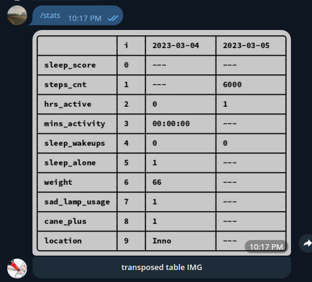
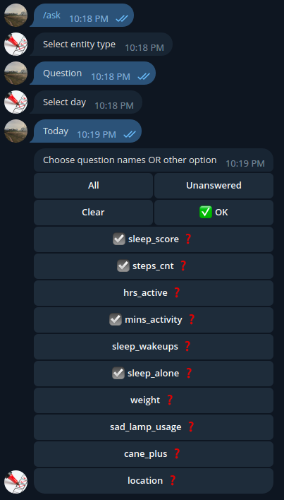
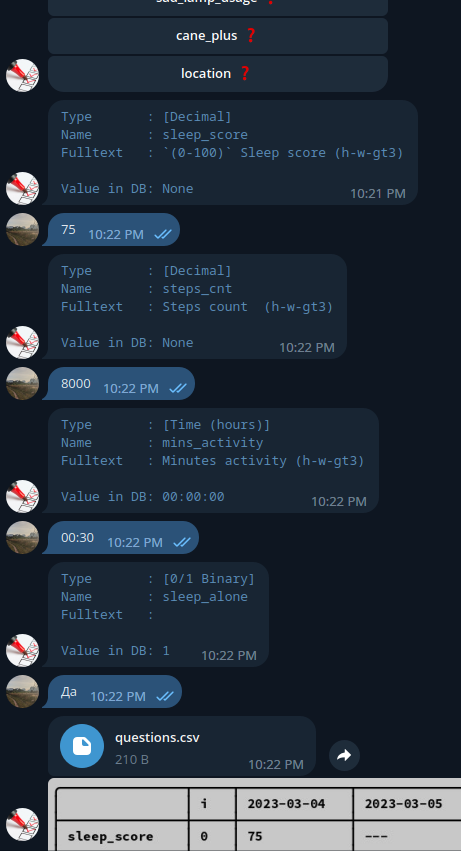

## `Metrics.tg-bot`

### Key concept

My `telegram-bot` to manage **Daily metrics** (`Questions`), such as `weight`, `steps count`, and more.

Aside daily metrics, I have ***Events*** entity:
- It is to be marked when something occurs (f.e. `sleep time`, `wakeup time`, and more).

In addition, a more flexible abstraction that can be built on top of this is **_ongoing events_**
- For example, you periodically go to sport gym. When it is the case, you mark a new event called `sport_training` with text `start`.
- Then, at the end of you exercising, you mark new event with same name (`sport_training`) and text `end`.

Such events are somewhat I call `Durable` (a mistranslation, I know).

### Purpose

- In such a way I'm trying to somewhat systemize my life
- Also, after some period of time, a data collected may be analyzed, manually or programmatically (f.e. using **Machine learning**) to identify patterns and correlations between different metrics

### Features

- Subscribe to `.ics` calendar, aggregating `"Durable"` events
  - (see - [`ics/`_module](src/ics/README.md))

### Documentation (in progress)

- [`orm/`_module](src/orm/README.md)
- [`ics/`_module](src/ics/README.md)
- `setup.MD` (not ready)
- `tables.py` module docs (not ready)

### Screenshots

[//]: # (![img.png]&#40;assets/screenshot2.png&#41;)

